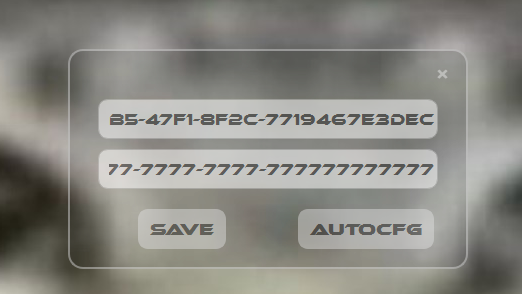
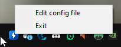

# Переключение TurboBoost

### 1. Как выклядит переключение

  
*Переключение TurboBoost*: При нажатии на F10 будет происходить отключеник/включение турбобуста.  

### 3. Генератор конфига

*Как открыть Генератор конфигов*: Нажмите в трее на икнонку приложения правой кнопкой мыши и нажмите Edit config file.

*AutoCFG*: Настроит все схемы питания сам, вам ничего делать не нужно.
*Save*: Применяет настройки и перезапускает основную C++ программу которая является переключаетелем.

## Как использовать

1. Требования к MSVC 2022
```bash
Стандарт языка: /std:c++17
Подсистема: /subsystem:windows
